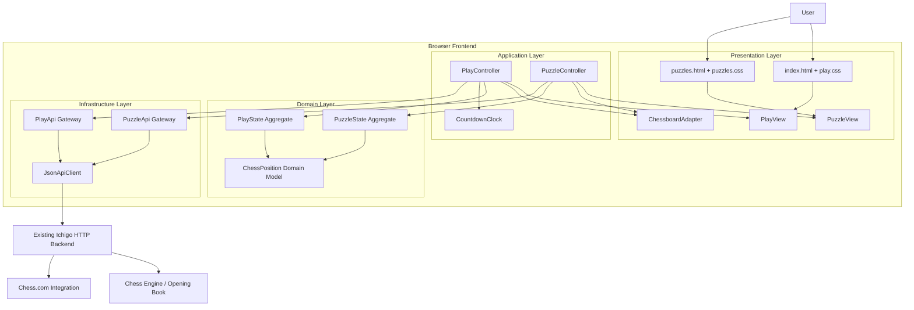
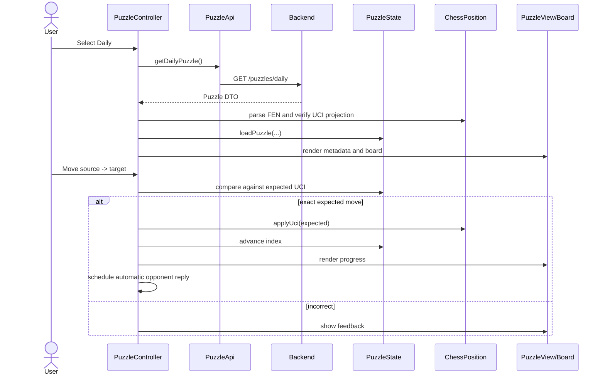
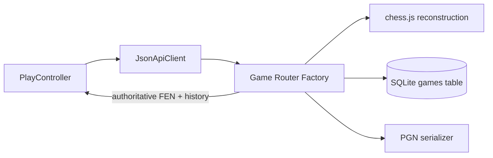

# High-Level Design

## 1. Architectural goals

The refactor is designed around six quality attributes:

1. **Correctness:** server-authoritative legal Play moves; structurally correct FEN/UCI projection.
2. **Modifiability:** page concerns are isolated behind explicit component boundaries.
3. **Testability:** domain and infrastructure modules do not depend on the browser DOM.
4. **Understandability:** each file has one dominant reason to change.
5. **Reliability:** stale asynchronous responses and rejected optimistic moves cannot silently corrupt current state.
6. **Security:** server/user values are rendered with `textContent`, not injected as HTML.

## 2. Architectural style

The system is a two-page, server-backed web frontend using a **Layered Architecture** and feature-oriented packaging.



## 3. Layer responsibilities

### Presentation layer

Owns browser-specific concerns:

- HTML structure and accessibility labels.
- Styling and responsive layout.
- DOM reads/writes.
- chessboard.js integration.
- User-event registration.

It does **not** own HTTP URL construction, business workflow, or authoritative game state.

### Application layer

Coordinates use cases:

- Start game.
- Submit player move.
- Request engine move.
- Request hint.
- Finish game.
- Load daily/random puzzle.
- Analyze recent Chess.com games.
- Advance/reset/auto-play puzzle solutions.

Controllers decide sequencing and error recovery but delegate state representation and transport details.

### Domain layer

Owns browser-independent state and invariants:

- Board pieces.
- FEN fields.
- Side to move.
- Castling rights.
- En-passant target.
- Promotion projection.
- Play lifecycle state.
- Puzzle progress and source state.

### Infrastructure layer

Owns external communication:

- `fetch` and JSON serialization.
- HTTP errors.
- Endpoint URL construction.
- Request/response DTO boundaries.

## 4. Trust boundaries and sources of truth

### Backend authority

The server is authoritative for:

- Legal Play move validation.
- Checkmate, stalemate, repetition, and material results.
- PGN persistence.
- Engine and opening-book output.
- Puzzle generation and solution data.

### Frontend authority

The browser is authoritative only for:

- Current visual projection.
- User interface state.
- Local clock display.
- Current source/filter selection.
- Optimistic UI rollback snapshot.

### Why this matters

A complete chess engine requires attack maps, legal move generation, check detection, castling-through-check rules, repetition history, and more. Duplicating that incorrectly in the browser would create split-brain behavior: the frontend could accept a move the server rejects or reject a move the server accepts.

## 5. Play use-case flow

```mermaid
sequenceDiagram
    actor U as User
    participant V as PlayView/Board
    participant C as PlayController
    participant S as PlayState
    participant P as ChessPosition
    participant A as PlayApi
    participant B as Backend

    U->>V: Drop piece
    V->>C: handleDrop(source, target)
    C->>S: createMemento()
    C->>P: applyUci(uci)
    C->>S: append move; lock input
    C->>V: render optimistic position
    C->>A: submitMove(gameId, uci)
    A->>B: POST /game/:id/move
    alt accepted
      B-->>A: state/result DTO
      A-->>C: accepted
      C->>S: unlock input
      opt engine turn
        C->>A: getBookMove/getBestMove
        A->>B: engine request
        B-->>C: bestmove
        C->>P: applyUci(bestmove)
        C->>A: submitMove(bestmove)
      end
    else rejected or network failure
      B-->>A: error
      A-->>C: ApiError
      C->>S: restore(memento)
      C->>V: render rollback
    end
```

## 6. Puzzle use-case flow



## 7. Runtime topology

```text
Browser
  ├── static HTML/CSS/ES modules
  ├── jQuery (required by chessboard.js 1.0.0)
  └── chessboard.js
        │
        │ same-origin HTTP/JSON
        ▼
Existing Node server
  ├── game session endpoints
  ├── engine/book endpoints
  ├── puzzle endpoints
  └── Chess.com integration
```

No build step is required. Browser-native ES modules are served as static `.mjs` files.

## 8. Deployment assumptions

- The existing server serves the `public/` directory.
- `/` resolves to `public/index.html`.
- `/puzzles` resolves to `public/puzzles.html` or an equivalent route.
- API and static content share the same origin.
- `public/chessboardjs-1.0.0/` already exists.
- Modern browsers support ES modules, private class methods, optional chaining, and `AbortController`.

## 9. Reconciled backend architecture

After review of the supplied `server.js` excerpt, the package also includes an optional extraction for persisted-game routes.



The router remains part of the same Node deployment. This is a **layered modular monolith**, not a microservice split.

### Accepted-state synchronization

The server’s accepted-move response is a synchronization event:

```text
HTTP 2xx move response
    ├── fen   -> replace ChessPosition projection
    └── moves -> replace move-history projection
```

The frontend still performs optimistic rendering for responsiveness, but after acceptance it converges on server state. Rejection restores the pre-command Memento.

### Optional backend module boundaries

- `server/game-route-helpers.cjs`: pure input Value Object parsing and validation.
- `server/game-routes.cjs`: Router Factory and route-level Transaction Scripts.
- Existing `gameFromMoves`: chess domain reconstruction collaborator.
- Existing `uciListToPgn`: output serializer collaborator.
- Existing `DB`: repository implementation passed through Dependency Injection.
