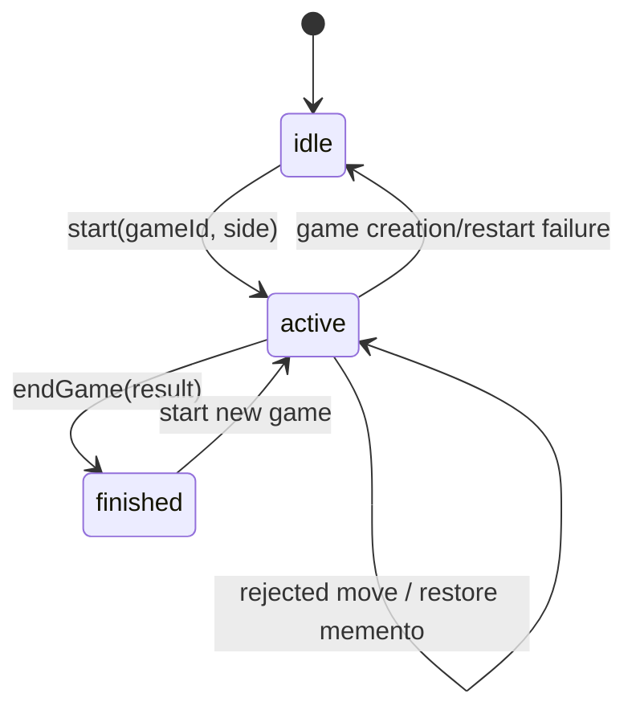

# Low-Level Design

## 1. Design approach

The LLD uses small collaborating objects rather than a framework. Dependencies are passed through constructors, making control flow explicit and enabling substitution in tests.

## 2. Pattern inventory

| Pattern | Implementation | Purpose |
|---|---|---|
| Domain Model | `ChessPosition` | Represents position state and trusted UCI projection behavior. |
| Aggregate Root | `PlayState`, `PuzzleState` | Defines the consistency boundary for each page's mutable state. |
| Controller / Application Service | `PlayController`, `PuzzleController` | Orchestrates complete user use cases. |
| Passive View | `PlayView`, `PuzzleView` | Encapsulates DOM access without making workflow decisions. |
| Repository / Gateway | `PlayApi`, `PuzzleApi` | Hides endpoint details behind domain-oriented methods. |
| Adapter | `ChessboardAdapter` | Converts `ChessPosition` into chessboard.js calls and CSS highlights. |
| Memento | `PlayState.createMemento()` | Rolls back optimistic local moves after server rejection. |
| Service Object | `CountdownClock`, `JsonApiClient` | Encapsulates reusable process behavior. |
| Dependency Injection | Controller constructors | Makes dependencies explicit and replaceable. |
| Composition Root | `play.mjs`, `puzzles.mjs` | Creates and wires the object graph in one location. |

The design does not introduce factories, event buses, command objects, or formal State classes because the current scale does not justify them.

## 3. Core domain model: ChessPosition

### Responsibility

Maintain a self-contained chess-position projection that can:

- Parse and emit FEN.
- Resolve board squares.
- Expose pieces to controllers.
- Produce chessboard.js position objects.
- Apply trusted UCI moves.
- Maintain side-to-move, castling, en-passant, and move counters.
- Clone itself for rollback and verification.

### Inputs

- FEN string through `ChessPosition.fromFen(fen)`.
- UCI string through `applyUci(uci)`.
- Square string through `pieceAt(square)`.

### Outputs

- `ChessPosition` object.
- FEN string from `toFen()`.
- chessboard.js map from `toChessboardPosition()`.
- `MoveRecord` from `applyUci()`.

### MoveRecord shape

```javascript
{
  uci: 'e2e4',
  from: 'e2',
  to: 'e4',
  promotion: null,
  movingPiece: { color: 'w', type: 'p' },
  capturedPiece: null,
  capturedSquare: null,
  sideToMove: 'b',
  fen: '...'
}
```

### Invariants

- Board is always 8 by 8.
- Piece color is `w` or `b`.
- Piece type is `p`, `n`, `b`, `r`, `q`, or `k`.
- `sideToMove` is `w` or `b`.
- En-passant square is null or a valid square.
- UCI syntax is `from + to + optional promotion`.
- A promotion suffix belongs only to a pawn reaching rank 1 or 8.
- A diagonal pawn move to an empty square requires the current en-passant target.
- Castling projection requires a matching rook before mutation.

### Deliberate non-invariants

`ChessPosition` does not prove:

- Piece movement geometry.
- King safety.
- Squares attacked during castling.
- Check/checkmate.
- Threefold repetition.
- Fifty-move draw.

Those belong to the backend chess rules engine.

## 4. PlayState Aggregate

### Primary fields

| Field | Type | Meaning |
|---|---|---|
| `position` | `ChessPosition` | Current visual position. |
| `moves` | `string[]` | UCI moves from the standard starting position. |
| `lifecycle` | enum string | `idle`, `active`, or `finished`. |
| `gameId` | string/null | Server game-session identifier. |
| `humanColor` | `w`/`b` | Side controlled by the user. |
| `hintMove` | string/null | Current highlighted engine suggestion. |
| `inputLocked` | boolean | Prevents overlapping move submissions. |
| `sessionVersion` | number | Invalidates stale asynchronous work. |

### State transitions



### Memento behavior

Before an optimistic user or engine move, the controller stores:

- Position clone.
- Move list clone.
- Hint move.
- Input lock state.

If persistence fails, the aggregate restores all four together. This prevents partial rollback.

## 5. PuzzleState Aggregate

### Primary fields

| Field | Type | Meaning |
|---|---|---|
| `position` | `ChessPosition` | Current puzzle projection. |
| `startFen` | string/null | Reset point. |
| `solution` | `string[]` | Ordered exact UCI solution. |
| `index` | number | Next expected move index. |
| `initialSide` | `w`/`b` | Determines side-to-move orientation. |
| `viewMode` | `side`/`white` | Orientation policy. |
| `selectedSquare` | string/null | Click-to-move source. |
| `validationError` | string/null | Blocks interaction for inconsistent puzzle data. |
| `fromGamePuzzles` | array | Current personalized puzzle collection. |

### Puzzle acceptance rule

A user move is accepted only when:

```text
source == expectedUci[0:2]
and
target == expectedUci[2:4]
```

Promotion is taken from the expected UCI, so underpromotions work even though the UI asks only for source and destination.

## 6. Controllers

### PlayController public interface

| Method | Input | Output/side effect |
|---|---|---|
| `initialize()` | none | Binds UI and renders idle state. |
| `canDrag(source, pieceCode)` | strings | Boolean for chessboard.js. |
| `handleDrop(source, target)` | squares | `'snapback'` or optimistic move start. |
| `startNewGame()` | none | Creates session and starts clock. |
| `requestHint()` | none | Highlights backend best move. |
| `requestEngineMove()` | none | Gets, projects, and persists engine move. |
| `finishGame()` | none | Finishes server session. |
| `endGame(result DTO)` | result data | Stops clock and renders final state. |
| `handleTimeout(color)` | `w`/`b` | Ends game locally by timeout. |

### PuzzleController public interface

| Method | Input | Output/side effect |
|---|---|---|
| `initialize()` | none | Binds UI and loads daily puzzle. |
| `selectSource(source)` | source enum | Cancels stale loads and switches workflow. |
| `handleDrop(source, target)` | squares | Accepts/rejects expected move. |
| `handleSquareClick(square)` | square | Manages click-to-move selection. |
| `resetPuzzle()` | none | Restores starting FEN. |
| `stepSolution()` | none | Applies one solution move. |
| `toggleAutoPlay()` | none | Starts/stops solution playback. |
| `loadGamesForUser()` | username from view | Loads games and ML-generated puzzles. |
| `startPuzzlesFromGame(username, game)` | DTOs | Generates puzzles from one PGN. |

## 7. Asynchronous consistency mechanisms

### Play session version

Every session transition changes `sessionVersion`. A delayed move/engine response is ignored unless its captured version still matches the active state.

### New-game request version

Repeated New Game clicks create increasing request versions. Only the most recent `/game/new` response may initialize state.

### Puzzle load version

Daily, random, and user-game loads capture an incrementing `loadVersion`. Switching source invalidates older responses.

### AbortController

Engine and hint requests can be aborted when the game ends or a new game starts.

## 8. Rendering rules

- Controllers call one `render()` method after coherent state changes.
- Views render text with `textContent`.
- `ChessboardAdapter` owns library-specific selectors and highlight classes.
- Views never mutate domain state.
- API gateways never mutate UI or domain state.

## 9. Error handling policy

| Error category | Behavior |
|---|---|
| Invalid local UCI/FEN | Throw `ChessDataError`; reject or mark puzzle inconsistent. |
| HTTP non-2xx | Throw `ApiError` with status and server body. |
| Network failure | Throw `ApiError` with original cause. |
| Player move rejected | Restore Memento and log reason. |
| Engine persistence failure | Restore Memento; unlock user after controller catch. |
| Stale async response | Ignore silently based on version token. |
| Public puzzle malformed | Display a load/contract error. |
| Puzzle solution inconsistent | Render position but block interaction. |
